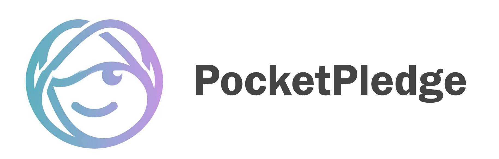
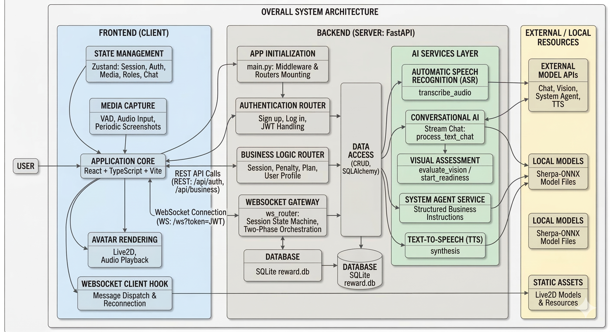
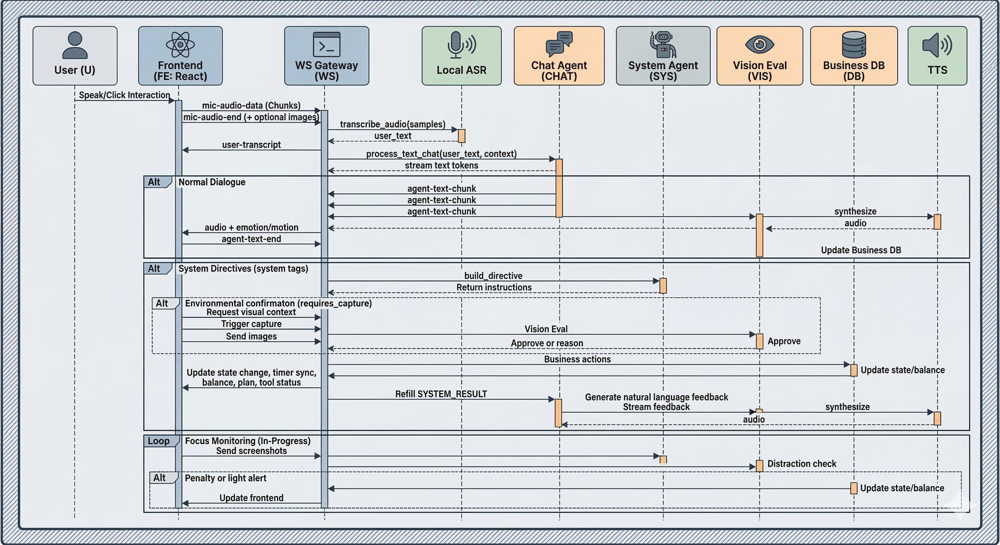

# PocketPledge

<div align="center">
  
</div>

<div align="center">
  <strong>PocketPledge</strong> 是一个面向学习监督场景的 AI 陪伴与监督系统。<br>
  结合 <b>Live2D 虚拟形象</b>、<b>实时语音对话</b>、<b>视觉状态分析</b> 和 <b>经济惩罚机制</b>，为你打造全方位的沉浸式电子学习体验。<br>
  <i>用真金白银的代价，终结你的分心时刻！</i>
</div>

---

## 🌟 核心魅力与特色

PocketPledge 打破了传统时间管理软件的枯燥与死板，将“陪伴”与“督导”完美融合：

- 🎭 **Live2D 虚拟伙伴**：告别冷冰冰的倒计时器！一位虚拟伙伴将陪你学习，让你的学习时光不再孤单枯燥。学习伙伴支持长效记忆，你将有机会与之缔造长久的羁绊。它还支持视觉读取，随时解答你的困惑。
- 🗣️ **实时语音对话**：通过强大的本地 ASR (Sherpa-ONNX) 与云端 TTS 的组合，加上代理模型的思考，实现较低延迟的语音流转。
- 👁️ **硬核视觉分心判定**：学习时不自觉地拿起手机、趴下睡觉？系统会对摄像头与屏幕进行非线性稀疏采样，由强大的多模态 AI 进行**实时状态分析**，捕捉你的每一次分心。想开小差？你的伙伴会用语音**主动**提醒你，不想让它失望的话就接着学习吧。
- 💰 **经济督导 (真金白银的考验)**：一旦被抓到分心并屡教不改，将立即扣除一定罚金。真实的余额结算机制，用痛感建立起最坚固的专注力防线。

> **注：由于我们尚未将该项目部署为云服务，因此目前仅提供本地部署的版本。罚金机制也仅作用于本地的虚拟账户，不会影响真实资金。**


## 📁 目录结构与技术栈概览

- **前端 (`frontend/`)**：React + TypeScript + Vite, Tailwind CSS v4, Zustand 状态管理。负责聊天 UI、Live2D 展示、录音采集与 WebSocket 通信。
- **后端 (`backend/`)**：FastAPI + Python 3.12, SQLAlchemy。负责核心业务（钱包、惩罚结算）、WebSocket 网关路由、本地 ASR 推理及 TTS 转发。 `uv` 包管理与运行。
- **文档 (`docs/`)**：REST API 标准与 WebSocket 协议文档。



---

## 🚀 快速开始与安装指南

**重要提示：本项目重度依赖 ASR 模型（Sherpa-ONNX），请务必按照下方指南完整下载并放置模型文件。**

### 0. 环境前置要求

- **Node.js**: `v20+` 并且严格使用 `pnpm` (`npm` 和 `yarn` 在本项目中被禁止)。
- **Python**: `3.12+`。
- **uv**: 使用 `uv` 进行 Python 环境和包管理。
- **Visual Studio C++ Build Tools**: 后端需要使用该环境。

### 1. 准备本地 ASR 模型 (Sherpa-ONNX SenseVoice)

为了实现低延迟的语音交互，麦克风音频流会通过 WebSocket 实时发送给后端进行 ASR 转写。

1. **下载模型**：
   前往 Sherpa-ONNX 官方资源库或 HuggingFace 获取对应的模型包 (`sherpa-onnx-sense-voice-zh-en-ja-ko-yue-2024-07-17`)。
2. **确认文件就绪**：
   解压后，请确保包内包含以下关键文件，并记录其**绝对路径**：
   - `model.int8.onnx`
   - `tokens.txt`

### 2. 后端配置与启动 (Backend)

进入后端目录并使用 `uv` 进行环境安装与管理：

```bash
cd backend
# 创建并同步后端依赖环境
uv sync
uv pip install opencv-python
```

**配置环境变量 (`backend/.env`)**：

在 `backend` 目录下复制 `.env.example` 并命名为 `.env`，然后填入你的真实配置：

```env
# 开启本地代理模型架构
AGENT_BACKEND=local

# ----------------- ASR 模型路径 -----------------
# (严格替换为你本地解压后的真实绝对路径)
MEDIA_AI_SHERPA_MODEL_PATH="/绝对路径/sherpa-onnx/model.int8.onnx"
MEDIA_AI_SHERPA_TOKENS_PATH="/绝对路径/sherpa-onnx/tokens.txt"

# ----------------- AI 模型配置（可自定义） -----------------
# 聊天模型配置
LOCAL_CHAT_API_KEY="xxxxxxxxxxxxxxxxxxxxxxxx"
LOCAL_CHAT_API_BASE="https://generativelanguage.googleapis.com/v1beta/openai/"
LOCAL_CHAT_MODEL="gemini-3.1-flash-lite-preview"

# 视觉模型配置
LOCAL_VISION_API_KEY="sk-xxxxxxxxxxxxxxxxxxxxxxxx"
LOCAL_VISION_API_BASE="https://dashscope.aliyuncs.com/compatible-mode/v1"
LOCAL_VISION_MODEL="qwen3.5-flash"

# 系统代理模型配置
LOCAL_AGENT_API_KEY="xxxxxxxxxxxxxxxxxxxxxxxx"
LOCAL_AGENT_API_BASE="https://generativelanguage.googleapis.com/v1beta/openai/"
LOCAL_AGENT_MODEL="gemini-3.1-flash-lite-preview"
```

**启动后端服务**：
```bash
cd backend
uv run uvicorn app.main:app --host 0.0.0.0 --port 12393 --reload --reload-dir app --reload-dir scripts
```

*提示：初次启动会自动在 `backend/reward.db` 初始化数据库并创建必要的预设账户。*

*补充：建议在 `backend/.env` 中显式设置固定的 `AUTH_SECRET_KEY`。否则只要后端重启或热重载，之前签发的 JWT 就会失效，前端需要重新登录。*

**后端补充配置表** (可在 `.env` 覆盖默认行为)：

| 变量名 | 说明 | 默认值 |
|---|---|---|
| `DATABASE_URL` | 数据库文件路径 | `sqlite:///./reward.db` |
| `AUTH_SECRET_KEY` | 鉴权 JWT 的 Secret | 建议本地固定配置；未配置时使用仅限开发的固定回退值 |
| `MEDIA_AI_TTS_PROVIDER` | 语音合成服务商 | `qwen-realtime` |
| `MEDIA_AI_SHERPA_MODEL_TYPE` | 本地 ASR 模型类型 | `sense_voice` |

*注：如果 ASR 路径配置错误或找不到文件，系统在运行时不会出错崩溃，但用户的每一次语音输入均将回落为空白文本。*

### 3. 前端配置与启动 (Frontend)

请确保你已经安装了 `pnpm`。

```bash
cd frontend
# 安装依赖
pnpm install

# 启动开发服务器
pnpm run dev
```
启动完毕后，在浏览器中打开相应的本地地址 (默认 `http://localhost:5173/`)。前端会自动通过 WebSocket 连接到 `ws://localhost:12393/ws`。

> **快捷启动提示 (双端联合启动，推荐 Windows 用户)**：
> 在所有依赖和环境配置就绪后，你可以直接在项目根目录运行 `.\start-dev.cmd`，脚本会自动为你唤起双端的控制台进行联合启动。同时，它还会启动一个额外的“视觉调试器”窗口，方便你实时查看视觉监督模型的输入图片，提升调试效率。后端热重载只监视 `app/` 和 `scripts/`，不会因为 `.venv/` 下第三方依赖文件变化而误重启。

---

## 📚 详细文档与资料

想要深入了解 PocketPledge 的内部机制与协议，请参阅以下文档：

- 📄 **接口文档**: [docs/api_contract.md](docs/api_contract.md)
- 🔌 **协议说明**: [docs/ws_protocol.md](docs/ws_protocol.md)

## 🤝 致谢

- [Open-LLM-VTuber](https://github.com/Open-LLM-VTuber/Open-LLM-VTuber) 为本项目的 Live2D 与语音交互功能提供了宝贵的参考。
- [Sherpa-ONNX](https://github.com/k2-fsa/sherpa-onnx) 提供了强大的本地 ASR 模型支持，使得低延迟的语音交互成为可能。
- [Live2D](https://www.live2d.com/) 提供了 Live2D Web SDK和模型，使得虚拟形象的展示与交互得以实现。

> *“一旦你许下承诺 (Pledge)，就请专注于当下。”*
