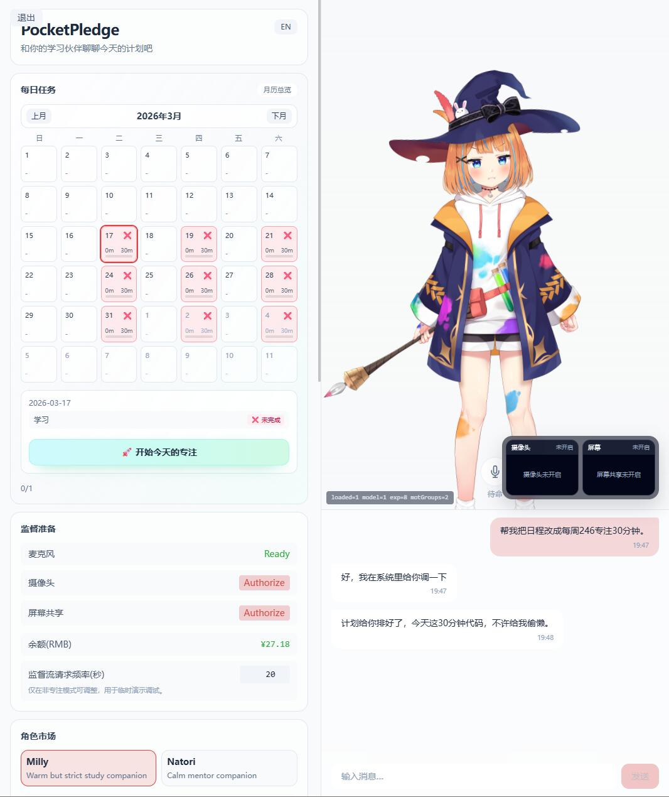

# WarmBuddy


<div align="center">
  <strong>WarmBuddy</strong> 是一个本地优先的 Live2D AI 陪伴系统，面向陪伴、情绪陪聊与实时语音互动。
</div>

<div align="center">
  <a href="README.md">English</a>
</div>

WarmBuddy 由 React + Live2D 前端和 FastAPI WebSocket 后端组成。用户登录后，主陪伴页会立即建立会话，前端发送一次 `page-opened` 事件，随后由所选角色主动用文本和语音打招呼。

## 当前产品形态

- 登录后打开页面即触发主动问候
- Live2D 角色、表情驱动、流式 TTS 与点击互动
- 基于 WebSocket 的实时语音对话，本地 ASR + OpenAI 兼容模型编排
- 定时摄像头情绪识别，以及 `<<CAPTURE>>` 按需视觉补采
- 陪伴面板内置情绪记录、饮食日记与心理自测
- `zh` / `en` 双语体验
- 本地鉴权、SQLite 持久化与长对话画像滚动记忆



## Monorepo 结构

| 路径 | 技术栈 | 责任 |
| --- | --- | --- |
| `frontend/` | React 19、TypeScript 5.9、Vite 7、Zustand 5、Tailwind 4 | Live2D 画布、聊天 UI、语音采集、情绪工具、WebSocket 客户端 |
| `backend/` | FastAPI 0.116+、Python 3.12+、SQLAlchemy 2、Pydantic 2 | 鉴权、WebSocket 编排、Agent 路由、ASR/TTS、数据持久化 |
| `docs/` | Markdown + 图示 | API 契约、WebSocket 协议、Docker 部署说明 |
| `Open-LLM-VTuber/` | 上游参考工程 | 仅供参考，不参与当前产品修改 |

## 交互流程

1. 前端恢复或获取 JWT，并带着 `token`、`locale`、`characterId` 连接 `/ws`。
2. 后端补齐最近聊天历史，先返回 `model-info`。
3. 主陪伴页在真实页面首开时只发送一次 `page-opened`。
4. 后端据此流式下发一条主动问候，包含文本和语音。
5. 随后的文字输入、VAD 语音输入、情绪更新和 `<<SYS>>` / `<<CAPTURE>>` 跟进，都复用同一条会话链路。

## 快速开始

### 环境要求

- Python 3.12+
- `uv`
- Node.js 20+
- `pnpm`
- 至少一套可用的本地 ASR 配置，以及一组 OpenAI 兼容模型服务

### 1. 配置后端

将 `backend/.env.example` 复制为 `backend/.env`，再填入真实模型地址与密钥。

最小本地配置示例：

```env
AGENT_BACKEND=local
AUTH_SECRET_KEY=replace-with-a-long-random-local-dev-secret

LOCAL_CHAT_API_KEY=sk-placeholder
LOCAL_CHAT_API_BASE=https://api.openai.com/v1
LOCAL_CHAT_MODEL=gpt-4o

LOCAL_VISION_API_KEY=sk-placeholder
LOCAL_VISION_API_BASE=https://api.openai.com/v1
LOCAL_VISION_MODEL=gpt-4o

LOCAL_AGENT_API_KEY=sk-placeholder
LOCAL_AGENT_API_BASE=https://api.openai.com/v1
LOCAL_AGENT_MODEL=gpt-4o
```

如果你希望使用 Sherpa-ONNX，而不是示例中的 ASR 配置，再补充：

```env
MEDIA_AI_ASR_PROVIDER=sherpa-onnx
MEDIA_AI_SHERPA_MODEL_PATH=/绝对路径/model.int8.onnx
MEDIA_AI_SHERPA_TOKENS_PATH=/绝对路径/tokens.txt
```

安装后端依赖：

```bash
cd backend
uv sync
```

### 2. 配置前端

```bash
cd frontend
pnpm install
```

### 3. 运行项目

手动启动：

```bash
cd backend
uv run uvicorn app.main:app --host 0.0.0.0 --port 12393 --reload --reload-dir app --reload-dir scripts
```

```bash
cd frontend
pnpm run dev
```

Windows 一键启动：

```cmd
.\start-dev.cmd
```

打开 `http://localhost:5173/`，登录后进入主页面，当前角色会在页面挂载完成后主动问候你。

### 4. Linux Docker 部署

Linux 环境可直接使用：

```bash
chmod +x deploy-linux.sh
./deploy-linux.sh
```

脚本会创建 `.env.docker`、补齐 `AUTH_SECRET_KEY`、下载 Sherpa 模型并启动 compose。详见 [docs/docker-linux-deploy.md](docs/docker-linux-deploy.md)。

## 开发命令

后端：

```bash
cd backend
uv run pytest tests/
uv run ruff check .
uv run ruff format --check .
```

前端：

```bash
cd frontend
pnpm run lint
pnpm run build
```

## 开发说明

- `Open-LLM-VTuber/` 是参考代码，不要在常规产品开发中直接修改。
- 本地开发请固定 `AUTH_SECRET_KEY`，否则每次后端重载都会让现有 JWT 失效。
- 后端热重载目录应保持在 `app/` 和 `scripts/`，避免无关文件引发频繁重启。
- 前端默认跟随当前域名访问 `/api` 和 `/ws`，这样本机、局域网和反向代理场景更容易保持一致。

## 文档

- [docs/api_contract.md](docs/api_contract.md)
- [docs/ws_protocol.md](docs/ws_protocol.md)
- [docs/docker-linux-deploy.md](docs/docker-linux-deploy.md)
- [frontend/docs/backend-interface.md](frontend/docs/backend-interface.md)
- [DevelopmentPlan/plan.md](DevelopmentPlan/plan.md)

## 致谢

- [Open-LLM-VTuber](https://github.com/Open-LLM-VTuber/Open-LLM-VTuber) 提供了 Live2D 与语音链路的上游参考
- [Live2D](https://www.live2d.com/) 提供了 Web SDK 与模型生态
- [Sherpa-ONNX](https://github.com/k2-fsa/sherpa-onnx) 与 [faster-whisper](https://github.com/SYSTRAN/faster-whisper) 提供了本地 ASR 方案选择
