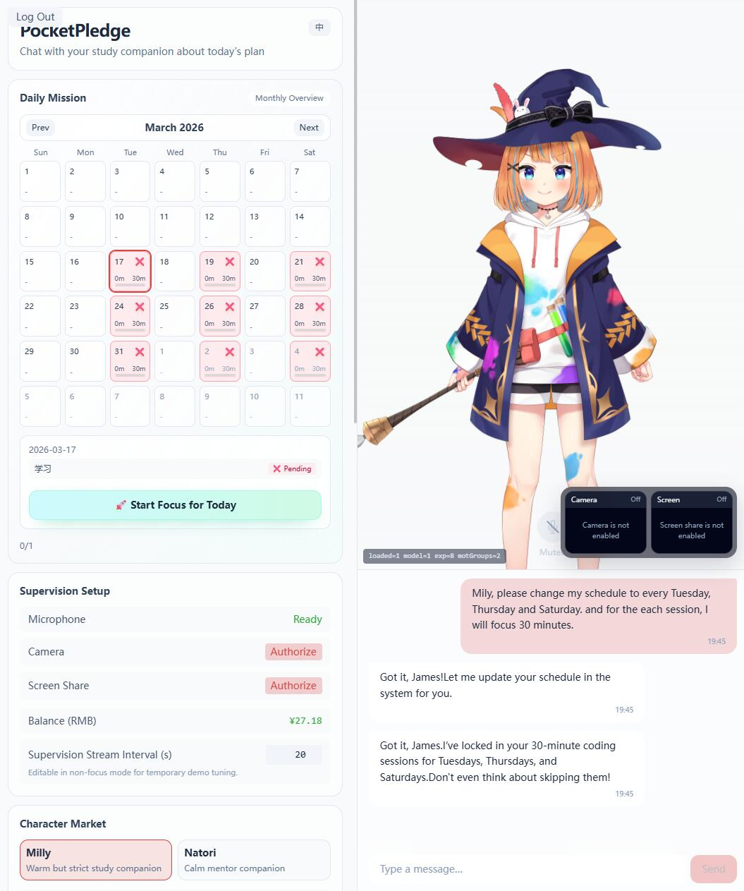

# PocketPledge

<div align="center">
  
</div>

<div align="center">
  <strong>PocketPledge</strong> is an AI companionship and supervision system designed for study-monitoring scenarios.<br>
  It integrates <b>Live2D virtual avatars</b>, <b>real-time voice conversations</b>, <b>visual state analysis</b>, and <b>economic penalty mechanisms</b> to create a fully immersive e-learning experience.<br>
  <i>Put your money where your mouth is and end distractions for good!</i>
</div>

---

## 🌟 Core Highlights & Features

PocketPledge breaks the monotony and rigidity of traditional time-management tools by perfectly blending "companionship" with "supervision":

- 🎭 **Live2D Virtual Companion**: Say goodbye to cold countdown timers! A virtual partner will accompany you while you study, making your learning sessions no longer lonely or dull. The study companion supports long-term memory, giving you the opportunity to build lasting bonds. It also supports visual recognition and is always ready to answer your questions.
- 🗣️ **Real-time Voice Conversations**: Through a combination of powerful on-device ASR (Sherpa-ONNX) and cloud-based TTS, along with agent-based reasoning, we achieve low-latency voice interaction.
- 👁️ **Hardcore Visual Distraction Detection**: Casually pick up your phone or lie down to nap during study sessions? The system performs non-linear sparse sampling of your camera and screen, analyzed in **real-time by powerful multimodal AI** to catch every moment of distraction. Thinking of slacking off? Your companion will **proactively** remind you with voice prompts. If you don't want to let them down, just keep studying.
- 💰 **Economic Supervision (Real Money at Stake)**: Once you're caught distracted and fail to correct after reminders, a penalty fee will be instantly deducted. A real balance settlement mechanism builds the strongest defense for focus through the pain of loss.



> **Note: Since we haven't deployed this project as a cloud service yet, currently only a local deployment version is available. The penalty mechanism only affects a local virtual account and does not involve real funds.**

## 📁 Directory Structure & Tech Stack Overview

- **Frontend (`frontend/`)**: React + TypeScript + Vite, Tailwind CSS v4, Zustand for state management. Handles chat UI, Live2D display, audio recording, and WebSocket communication.
- **Backend (`backend/`)**: FastAPI + Python 3.12, SQLAlchemy. Manages core business logic (wallet, penalty settlement), WebSocket gateway routing, on-device ASR inference, and TTS forwarding. Uses `uv` for package management and execution.
- **Docs (`docs/`)**: Contains REST API standards and WebSocket protocol documentation.


---

## 🚀 Quick Start & Installation Guide

**Important: This project heavily relies on the ASR model (Sherpa-ONNX). Please ensure you follow the guide below to completely download and place the model files.**

### 0. Prerequisites

- **Node.js**: `v20+` and strictly use `pnpm` (`npm` and `yarn` are prohibited in this project).
- **Python**: `3.12+`.
- **uv**: Use `uv` for Python environment and package management.
- **Visual Studio C++ Build Tools**: Required for the backend environment.

### 1. Prepare the On-device ASR Model (Sherpa-ONNX SenseVoice)

To achieve low-latency voice interaction, microphone audio streams are sent to the backend in real-time via WebSocket for ASR transcription.

1. **Download the Model**:
   Go to the official Sherpa-ONNX repository or HuggingFace to obtain the corresponding model package (`sherpa-onnx-sense-voice-zh-en-ja-ko-yue-2024-07-17`).
2. **Ensure Files are Ready**:
   After extraction, make sure the package contains the following key files and note their **absolute paths**:
   - `model.int8.onnx`
   - `tokens.txt`

### 2. Backend Configuration & Startup

Navigate to the backend directory and use `uv` for environment setup and management:

```bash
cd backend
# Create and sync the backend dependency environment
uv sync
```

**Configure Environment Variables (`backend/.env`)**:

Copy `.env.example` in the `backend` directory and rename it to `.env`, then fill in your actual configuration:

```env
# Enable local agent model architecture
AGENT_BACKEND=local

# ----------------- ASR Model Paths -----------------
# (Strictly replace with the absolute paths of your local extracted files)
MEDIA_AI_SHERPA_MODEL_PATH="/absolute/path/sherpa-onnx/model.int8.onnx"
MEDIA_AI_SHERPA_TOKENS_PATH="/absolute/path/sherpa-onnx/tokens.txt"

# ----------------- AI Model Configuration (Customizable) -----------------
# Chat model configuration
LOCAL_CHAT_API_KEY="xxxxxxxxxxxxxxxxxxxxxxxx"
LOCAL_CHAT_API_BASE="https://generativelanguage.googleapis.com/v1beta/openai/"
LOCAL_CHAT_MODEL="gemini-3.1-flash-lite-preview"

# Vision model configuration
LOCAL_VISION_API_KEY="sk-xxxxxxxxxxxxxxxxxxxxxxxx"
LOCAL_VISION_API_BASE="https://dashscope.aliyuncs.com/compatible-mode/v1"
LOCAL_VISION_MODEL="qwen3.5-flash"

# System agent model configuration
LOCAL_AGENT_API_KEY="xxxxxxxxxxxxxxxxxxxxxxxx"
LOCAL_AGENT_API_BASE="https://generativelanguage.googleapis.com/v1beta/openai/"
LOCAL_AGENT_MODEL="gemini-3.1-flash-lite-preview"
```

**Start the Backend Service**:
```bash
cd backend
uv run uvicorn app.main:app --host 0.0.0.0 --port 12393 --reload --reload-dir app --reload-dir scripts
```

*Tip: On first start, the database `backend/reward.db` will be automatically initialized and necessary default accounts created.*

*Note: Set a fixed `AUTH_SECRET_KEY` in `backend/.env` for local development. Otherwise any backend restart or hot reload invalidates previously issued JWTs and forces the frontend to log in again.*

**Backend Additional Configuration Table** (can override defaults in `.env`):

| Variable Name | Description | Default Value |
|---|---|---|
| `DATABASE_URL` | Database file path | `sqlite:///./reward.db` |
| `AUTH_SECRET_KEY` | JWT authentication secret | Recommended to set locally; otherwise a development-only fixed fallback is used |
| `MEDIA_AI_TTS_PROVIDER` | TTS service provider | `qwen-realtime` |
| `MEDIA_AI_SHERPA_MODEL_TYPE` | Local ASR model type | `sense_voice` |

*Note: If the ASR paths are incorrectly configured or files are not found, the system will not crash during runtime, but every voice input from the user will default to blank text.*

### 3. Frontend Configuration & Startup

Ensure you have `pnpm` installed.

```bash
cd frontend
# Install dependencies
pnpm install

# Start the development server
pnpm run dev
```
After startup, open the corresponding local address in your browser (default `http://localhost:5173/`). The frontend will automatically connect to the backend via WebSocket at `ws://localhost:12393/ws`.

> **Quick Start Tip (Combined Startup, Recommended for Windows Users)**:
> Once all dependencies and environment configurations are ready, you can simply run `.\start-dev.cmd` in the project root directory. The script will automatically launch console windows for both the frontend and backend for combined startup. Additionally, it will start an extra "Vision Debugger" window, allowing you to view the input images of the visual supervision model in real-time, enhancing debugging efficiency. Backend hot reload watches only `app/` and `scripts/`, so dependency changes under `.venv/` do not trigger spurious restarts.

---

## 📚 Detailed Documentation

To delve deeper into the internal mechanisms and protocols of PocketPledge, please refer to the following documents:

- 📄 **API Contract**: [docs/api_contract.md](docs/api_contract.md)
- 🔌 **Protocol Specification**: [docs/ws_protocol.md](docs/ws_protocol.md)

## 🤝 Acknowledgements

- [Open-LLM-VTuber](https://github.com/Open-LLM-VTuber/Open-LLM-VTuber) provided valuable references for the Live2D and voice interaction functionalities in this project.
- [Sherpa-ONNX](https://github.com/k2-fsa/sherpa-onnx) offered powerful on-device ASR model support, making low-latency voice interaction possible.
- [Live2D](https://www.live2d.com/) provided the Live2D Web SDK, enabling the display and interaction of virtual avatars.

> *"Once you make a pledge, focus on the present moment."*
